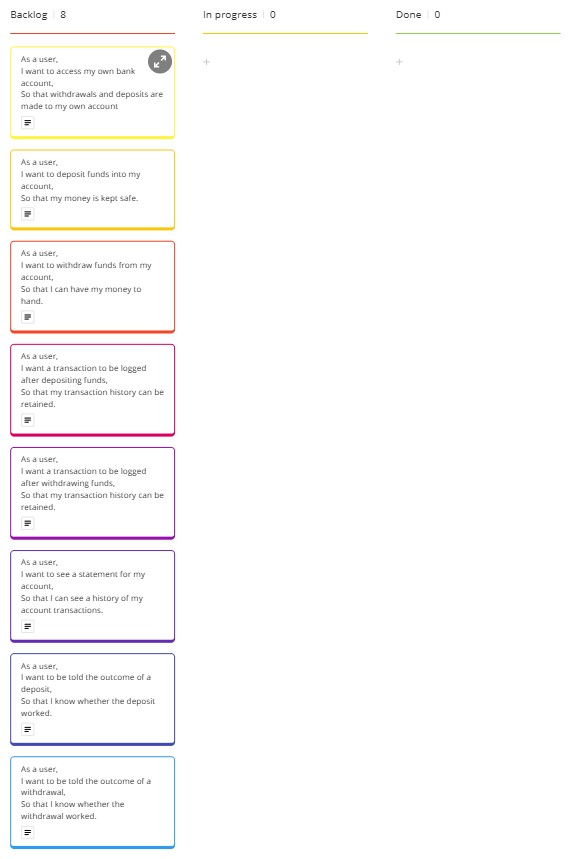

# Domain Models and Test Plan

## User Stories

### User Story 1
As a user,
I want to access my own bank account,
So that withdrawals and deposits are made to my own account

### User Story 2
As a user,
I want to deposit funds into my account,
So that my money is kept safe.

### User Story 3
As a user,
I want to withdraw funds from my account,
So that I can have my money to hand.

### User Story 4
As a user,
I want a transaction to be logged after depositing funds,
So that my transaction history can be retained.

### User Story 5
As a user,
I want a transaction to be logged after withdrawing funds,
So that my transaction history can be retained.

### User Story 6
As a user,
I want to see a statement for my account,
So that I can see a history of my account transactions.

### User Story 7
As a user,
I want to be told the outcome of a deposit,
So that I know whether the deposit worked.

### User Story 8
As a user,
I want to be told the outcome of a withdrawal,
So that I know whether the withdrawal worked.

## Domain Model

### User Story 1

| Objects         | Properties                                            | Messages                                            | Output            |
| --------------- | ----------------------------------------------------- | --------------------------------------------------- | ----------------- |
| Account         | accountNumber @Number                                 |                                                     |                   |
| AccountAccessor | accounts @Array[@Account] accessedAccount @Account | setAccessedAccount(@Number) getAccessedAccount() | @Void @Account |

### User Story 2

| Objects | Properties     | Messages           | Output |
| ------- | -------------- | ------------------ | ------ |
| Account | credit @Number | addCredit(@Number) | @Void  |

### User Story 3

| Objects | Properties     | Messages              | Output |
| ------- | -------------- | --------------------- | ------ |
| Account | credit @Number | removeCredit(@Number) | @Void  |

### User Story 4

| Objects     | Properties                                          | Messages           | Output |
| ----------- | --------------------------------------------------- | ------------------ | ------ |
| Transaction | date @Date amount @Number                        |                    |        |
| Account     | credit @Number transactions @Array[@Transaction] | addCredit(@Number) | @Void  |

### User Story 5

| Objects     | Properties                                          | Messages              | Output |
| ----------- | --------------------------------------------------- | --------------------- | ------ |
| Transaction | date @Date amount @Number                        |                       |        |
| Account     | credit @Number transactions @Array[@Transaction] | removeCredit(@Number) | @Void  |

### User Story 6

| Objects          | Properties                        | Messages                             | Output               |
| ---------------- | --------------------------------- | ------------------------------------ | -------------------- |
| Transaction      | date @Date amount @Number      |                                      |                      |
| Account          | transactions @Array[@Transaction] | getStatement()                       | @Array[@Transaction] |
| StatementPrinter |                                   | printStatement(@Array[@Transaction]) | @Void                |

### User Story 7

| Objects         | Properties               | Messages           | Output   |
| --------------- | ------------------------ | ------------------ | -------- |
| Account         | credit @Number           | addCredit(@Number) | @Boolean |
| AccountAccessor | accessedAccount @Account | addCredit(@Number) | @Void    |

### User Story 8

| Objects         | Properties               | Messages              | Output   |
| --------------- | ------------------------ | --------------------- | -------- |
| Account         | credit @Number           | removeCredit(@Number) | @Boolean |
| AccountAccessor | accessedAccount @Account | removeCredit(@Number) | @Void    |

## Test Plan

### User Story 1
#### Testing AccountAccessor.setAccessedAccount()
- [x] Should set accessedAccount to the correct Account when existing accountNumber passed
- [x] Should not change accessedAccount when non-existing accountNumber passed
- [x] Should not change accessedAccount when non-number type passed
- [x] Should not change accessedAccount when NaN passed
- [x] Should not change accessedAccount when undefined passed

### User Story 2
#### Testing Account.addCredit()
- [x] Should increase credit by correct amount when amount passed is positive number
- [x] Should not change credit when negative number passed
- [x] Should not change credit when 0 passed
- [x] Should not change credit when non-number passed
- [x] Should not change credit when NaN passed
- [x] Should not change credit when undefined passed
- [x] Should increase credit by correct amount when decimal passed
- [x] Should not change credit when more than 2 decimal places passed

### User Story 3
#### Testing Account.removeCredit()
- [x] Should decrease credit by correct amount when positive number less than credit passed
- [x] Should not change credit when positive number more than credit passed
- [x] Should decrease credit by correct amount when  number equal to credit passed
- [x] Should not change credit when negative number passed
- [x] Should not change credit when 0 passed
- [x] Should not change credit when credit 0 and 0 passed
- [x] Should not change credit when non-number passed
- [x] Should not change credit when NaN passed
- [x] Should not change credit when undefined passed
- [x] Should decrease credit by correct amount when decimal passed
- [x] Should not change credit when more than 2 decimal places passed

### User Story 4
#### Testing Account.addCredit()
- [x] Should add Transaction with correct values when valid number passed
- [x] Should not add Transaction when invalid number passed

### User Story 5
#### Testing Account.removeCredit()
- [x] Should add Transaction with correct values when valid number passed
- [x] Should not add Transaction when invalid number passed

### User Story 6
#### Testing StatementPrinter.printStatement()
- [x] Should print transaction history to acceptance criteria standards with basic input
- [x] Should print correctly when amount length longer than column title
- [x] Should print correctly with amounts of differing length
- [x] Should print message when no Transactions in Account

### User Story 7
#### Testing AccountAccessor.addCredit()
- [x] Should call addCredit on the accessed account with the given input
- [x] Should print message showing credit when accessedAccount.addCredit returns true
- [x] Should print message stating invalid amount when accessedAccount.addCredit returns false

#### Testing Account.addCredit()
- [x] Should return true with valid input
- [x] Should return false with invalid input

### User Story 8
#### Testing AccountAccessor.removeCredit()
- [x] Should call removeCredit on the accessed account with the given input
- [x] Should print message showing credit when accessedAccount.removeCredit returns true
- [x] Should print message stating invalid amount when accessedAccount.removeCredit returns false

#### Testing Account.removeCredit()
- [ ] Should return true with valid input
- [ ] Should return false with invalid input

## Kanban Board
